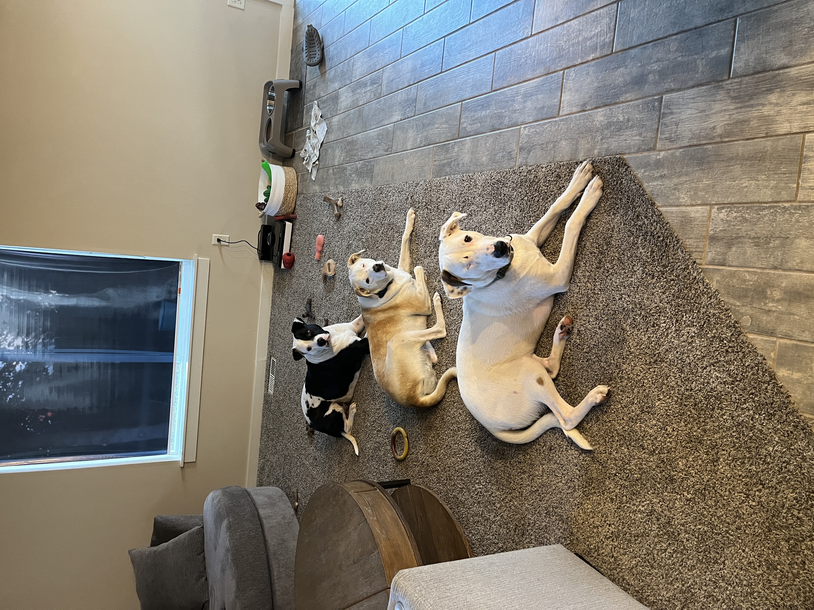

```{r}
#| include: false

library(tidyverse)
library(patchwork)
library(broom)
library(palmerpenguins)
library(ggformula)

knitr::opts_chunk$set(
  fig.width = 8,
  fig.asp = 0.618,
  fig.retina = 3,
  dpi = 300,
  out.width = "80%",
  fig.align = "center"
)

# set default theme and larger font size for ggplot2
ggplot2::theme_set(ggplot2::theme_bw(base_size = 16))
```

# Welcome!

## Meet Prof. Friedlander! {.midi}

::: incremental
-   Education and career journey
    -   Grew up outside New York City
    -   BS in Math & Statistics from Rice University (Houston, TX)
    -   Business Analyst at Capital One (Plano, TX)
    -   MS and PhD in Statistics & Operations Research from UNC-Chapel Hill
    -   Postdoc in Population Genetics at University of Chicago
    -   Assistant Professor of Math at St. Norbert College (Green Bay, WI)
-   Work focuses on statistics education, queuing theory, and population genetics
-   Big sports fan: NY Knicks, Giants, Rangers, Yankees, UNC Tarheels
-   Dad of three cute dogs: Allie, Miriam, Tony
:::

## Meet Prof. Friedlander! {.midi}



## Tell me about yourself {.smaller}

Send me an email with answers to the following questions following questions:

1. What would you like me to call you?
2. Why are you taking this class?
3. How are you feeling about taking this class? Be honest... you won't hurt my feelings.
4. Have you taken any statistics courses before (including high school)?
5. Have you ever written any code before? If so, in what lanuages?
6. Is there anything else you would like me to know about you? E.g. athlete, preferred pronouns, accommodations, etc...
7. What are some song recommendations for the class playlist (nothing that will get me in trouble)?

```{r}
#| echo: FALSE
countdown::countdown(minutes = 5L)
```


# Statistical modeling

## What is a model?

:::{.incremental}
- DATA = MODEL + ERROR
- DATA = PATTERN + DEPARTURES FROM PATTERN
  - How do we identify the actual pattern?
- **GOAL:** Find a model for a relationship between a **response/outcome/target variable** $Y$ and one (or more) **explanatory/predictor variables** ($X_1,\ldots,X_k$)
- Models are a simplified but tractable version of reality
:::


:::{.question}
What are *response* and *explanatory* variables?
:::

## Geoge E. P. Box

::::{.columns}
:::{.column}
- From Wikipedia: British statistician, who worked in the areas of quality control, time-series analysis, design of experiments, and Bayesian inference. He has been called "one of the great statistical minds of the 20th century".
- "all models are wrong, but some are useful"
:::
:::{.column}

:::
::::

## Why build a model?

1. Making predictions
2. Understanding relationships
3. Assessing differences

## What is regression analysis?

::: {style="font-size: 0.85em;"}
> "In statistical modeling, regression analysis is a set of statistical processes for estimating the relationships among variables. It includes many techniques for modeling and analyzing several variables, when ***the focus is on the relationship between a dependent variable and one or more independent variables (or 'predictors')***. More specifically, regression analysis helps one understand how the typical value of the dependent variable (or 'criterion variable') changes when any one of the independent variables is varied, while the other independent variables are held fixed."

Source: [Wikipedia](https://en.wikipedia.org/wiki/Regression_analysis) (previous definition)
:::

Note:  I don't really like the terms "independent" and "dependent" variables

# MATH 2025

## Course FAQ {.smaller}

**Q - What background is assumed for the course?**

A - Introductory statistics or previous experience with mathematics at a level that would allow you to learn intro stats concepts relatively easily

. . .

**Q - Will we be doing computing?**

A - Yes. We will use the computing language R for analysis and Quarto for writing up results.

. . .

**Q - Am I expected to have experience using any of these tools?**

A - No. I do not expect you to have any exposure to R and certainly not Quarto.

. . .

**Q - Will we learn the mathematical theory of regression?**

A - Yes and No. The course is primarily focused on application; however, we will discuss some of the mathematics of simple linear regression.

. . .

**Q - How much time should I be spending on this class?**

A - This is a 4-credit class that meets for 75 minutes, twice a week. That means that you should be spending approximately 9 hours *per week* working on this course (i.e. 6.5 hours outside of class)

## Course learning objectives {.midi}

By the end of the semester, you will be able to...

-   analyze real-world data to answer questions about multivariable relationships.
-   use R to fit and evaluate linear and logistic regression models.
-   assess whether a proposed model is appropriate and describe its limitations.
-   use Quarto to write reproducible reports.
-   effectively communicate statistical results through writing and oral presentations.

# Course overview

## Course toolkit {.midi}

-   **Course website**: [ericfriedlander.github.io/math2025-fa26](https://ericfriedlander.github.io/math2025-fa26)
    -   Central hub for the course!
    -   **Tour of the website**
-   **Canvas**: [cofi.instructure.com](https://cofi.instructure.com/)
    -   Gradebook
    -   Assignment submissions
    -   Announcements


## Computing toolkit

::: {.fragment fragment-index="1"}
{fig-alt="RStudio logo" fig-align="center" width="5.61in" height="1.6in"}
:::

::: {.fragment fragment-index="2"}
-   All analyses using R, a statistical programming language

-   Write reproducible reports in Quarto

-   Access RStudio through [College of Idaho Posit Workbench]()

    +     Use your College of Idaho email and password
:::

::: {.fragment fragment-index="3"}
-   ~~Sign into RStudio!~~ Currently under maintenance... will use on Monday.

```{r}
#| echo: FALSE
countdown::countdown(minutes = 3L)
```
:::


# Activities + assessments

## Prepare, Participate, Practice, Perform

::: small
::: incremental
-   **Prepare:** Introduce new content and prepare for lectures by completing the readings (and sometimes watching videos)

-   **Participate:** Attend and actively participate in lectures, office hours, team meetings

-   **Practice:** Practice applying statistical concepts and computing with application exercises during lecture, graded for completion

-   **Perform:** Put together what you've learned to analyze real-world data

    -   Homework assignments (individual)

    -   Two exams

    -   Final group project
:::
:::

## Grading {.smaller}

<center>

| Category              | Percentage |
|-----------------------|------------|
| Homework              | 15%        |
| Final Project         | 25%        |
| Exam 01               | 25%        |
| Exam 02               | 25%        |
| Application Exercises | 10%        |

See the [syllabus](https://ericfriedlander.github.io/math2025-fa26/syllabus) for details on how the final letter grade will be calculated.

## Support

-   Attend office hours to meet with Prof. Friedlander (Boone 126B)
    -   TBD
-   Use email for questions regarding personal matters and/or grades
-   See the [Course Support](https://ericfriedlander.github.io/math2025-fa26/support) page for more details

# Course policies

## Late Homework

-   There will be a 5% deduction for each 24-hour period the assignment is late for the first two days. After 2 days, students will receive a 30% reduction. No homework will be accepted after it is returned to the class.

## Late Application Exercises

AEs are due the class after they are assigned. No late work is accepted for application exercises, since these are designed as in-class activities to help you prepare for homework.

## School-Sponsored Events

-   If an application exercise, exam, or project must be missed due to a school-sponsored event, you must let me know at least a week ahead of time so that we can schedule a time for you to make up the work before you leave. If you must miss an exam or a project presentation due to illness, you must let me know before class that day so that we can schedule a time for you to take a make-up. Failure to adhere to this policy will result in a 35% penalty on the corresponding assignment.

## Academic integrity {.smaller}

> The College of Idaho maintains that academic honesty and integrity are essential values in the educational process. Operating under an Honor Code philosophy, the College expects conduct rooted in honesty, integrity, and understanding, allowing members of a diverse student body to live together and interact and learn from one another in ways that protect both personal freedom and community standards. Violations of academic honesty are addressed primarily by the instructor and may be referred to the [Student Judicial Board](https://collegeofidaho.smartcatalogiq.com/en/current/Undergraduate-Catalog/Policies-and-Procedures/Academic-Misconduct).

By participating in this course, you are agreeing that all your work and conduct will be in accordance with the College of Idaho Honor Code.

## Collaboration & sharing code

-   I have policies!

-   Let's read about them in the [Academic honesty](/syllabus.qmd#academic-honesty) section of the syllabus

## Use of artificial intelligence (AI) {.midi}

-   Class discussion
-   Break into groups of three and find a space on the board
-   Discuss the following questions:
    -   How well do you understand what generative AI is and what it is doing?
    -   What skills do you think will be less important in the future due to AI?
    -   What skills do you think are enduring?
    -   What do you think the course policy should be around AI use?


# Having a successful semester in MATH 2025

## Five tips for success

1.  Complete all the preparation work (readings and videos) before class.

2.  Ask questions.

3.  Start your work (homework and projects) early!

4.  Don't procrastinate and don't let a day pass by with lingering questions.

5.  Stay up-to-date on announcements on Canvas and sent via email.

## What should I know about this class

-   Steep learning curve in the beginning... stick with it! I promise you can do it!

-   More writing than you probably expected... it is not enough for Dr. F to know what you mean to say... you must say that! Dr F. always asks: "If this student said this in a job interview, would they get hired?"

-   In statistics, there is rarely one RIGHT answer... it's all about extracting information from data to make arguments

## Dr. F's Biggest Pet Peeve

-   Showing up late to class

# Questions?

What questions do we have?

## References
