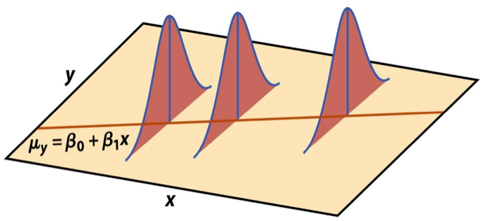

```{r setup}
#| include: false

library(countdown)

knitr::opts_chunk$set(
  fig.width = 8,
  fig.asp = 0.618,
  fig.retina = 3,
  dpi = 300,
  out.width = "80%",
  fig.align = "center"
)

# load packages
library(tidyverse)   # for data wrangling and visualization
library(ggformula)   # for plotting using formulas
library(broom)       # for formatting model output
library(scales)      # for pretty axis labels
library(knitr)       # for pretty tables
library(kableExtra)  # also for pretty tables
library(coursekata)  # for shuffle(), resample(), do(), b1()
library(openintro)   # for normTail()

# Spotify data: popular songs (track_popularity >= 80)
spotify <- read_csv(here::here("data/spotify-popular.csv")) |>
  mutate(duration_min = duration_ms / 60000)

# set default theme and larger font size for ggplot2
ggplot2::theme_set(ggplot2::theme_bw(base_size = 20))
```

## Last time {.smaller}

::: {.incremental style="font-size: 0.9em"}
- Our question was "does island explain **more** variation than chance?"
- We chose **PRE** as our statistic, **shuffled** the response to break any relationship, and built a **null distribution**.
- The **p-value** was the share of shuffles at least as extreme as our real data.
:::

. . .

::: question
Today: how do we choose a statistic that fits **our** question, and can we skip the shuffling by recognizing the shape of the null distribution?
:::

## Topics

- Choose a **test statistic** that captures a research question.
- Build its **null distribution**, and notice that it looks **normal**.
- Learn about the **normal distribution** and use it to compute p-values.
- Standardize the slope to get a **$t$ statistic**.
- Ask "what if we *don't* assume no relationship?" and build **confidence intervals**.

## Activity {.smaller}

Complete AE-10 then switch up roles and complete Exercises 1-2 of the activity below.

::: appex
📋 [AE 11 - What Makes a Song Danceable?](../ae/ae-11-spotify-inference.qmd)
:::

```{r}
#| echo: false
countdown(minutes = 20)
```

# Step 1: Choose a test statistic

## Danceability on Spotify {.smaller}

We have data on `r nrow(spotify)` of the most popular songs on Spotify (`track_popularity >= 80`).

```{r}
#| out.width: "65%"

gf_point(danceability ~ duration_min, data = spotify, alpha = 0.5) |>
  gf_lm() |>
  gf_labs(x = "Duration (minutes)", y = "Danceability")
```

::: question
**Research question:** Are longer songs more or less danceable? What does the picture suggest?
:::

## Fitting the model {.smaller}

```{r}
#| echo: true

spotify_fit <- lm(danceability ~ duration_min, data = spotify)

spotify_fit |>
  tidy() |>
  kable(digits = 4)
```

```{r}
#| echo: false
b1_obs <- coef(spotify_fit)[["duration_min"]]
n <- nrow(spotify)
```

::: question
Our slope is $\hat{\beta}_1 =$ `r round(b1_obs, 3)`: each extra minute is associated with a `r round(abs(b1_obs), 3)` `r if_else(b1_obs < 0, "decrease", "increase")` in danceability. **But is it real, or could shuffling produce a slope this big?**
:::

## Choosing a statistic {.smaller}

In Lesson 10, our question was about **how much variation a model explains**, so we used **PRE**.

::: question
For each research question, which statistic would you compute from the data?

1. Do men and women have different average ages at death?
2. Does island, a three-level variable, explain more variation in age at death than chance?
3. Are longer songs more or less danceable?
4. Is there *any* linear relationship between a song's loudness and its danceability?
:::

. . .

**The test statistic should capture the research question.** Questions about a **relationship between two variables** are about the slope, so our statistic is $\hat{\beta}_1$.

## Hypotheses {.smaller}

**Null hypothesis:** there is no linear relationship between duration and danceability.

$$H_0: \beta_1 = 0$$

**Alternative hypothesis:** there is a linear relationship.

$$H_A: \beta_1 \neq 0$$

. . .

::: question
- $\hat{\beta}_1$ is the slope in our **sample**. What is $\beta_1$?
- How would the alternative change if our question were "Are longer songs **less** danceable?"
:::

# Step 2: What is the null distribution of our statistic?

## Shuffling again {.smaller}

::: question
**Before I run this:** if I shuffle `danceability` 1000 times and compute the slope each time, what **shape** will the histogram have? Where will it be **centered**? Unlike PRE, can the statistic be negative?
:::

. . .

```{r}
#| echo: true

set.seed(2026)
null_b1 <- do(1000) * b1(shuffle(danceability) ~ duration_min, data = spotify)

head(null_b1, 3)
```

## The null distribution of $\hat{\beta}_1$ {.smaller}

```{r}
#| out.width: "70%"

gf_histogram(~ b1, data = null_b1, bins = 100, fill = "grey70", color = "white") |>
  gf_vline(xintercept = b1_obs, color = "#d53a19", linewidth = 1.5) |>
  gf_labs(x = "Slope from a shuffled data set", y = "Number of shuffles")
```

::: question
What is the shape? Where is the center? Where does our real slope (red line) land?
:::

## The simulation p-value {.smaller}

We want a **two-sided** p-value because $H_A: \beta_1 \neq 0$: count shuffles at least as far from 0 as ours, in *either* direction.

```{r}
#| echo: true

p_sim <- mean(abs(null_b1$b1) >= abs(b1_obs))
p_sim
```

::: question
Why did we only look at one tail with PRE but need both tails here?
:::

. . .

The histogram is **symmetric, bell-shaped, and centered at 0**. We've seen that shape before...

# The normal distribution

## Meet the normal distribution {.smaller}

```{r}
#| out.width: "65%"
#| echo: false

gf_histogram(~ b1, data = null_b1, bins = 30, fill = "grey70", color = "white",
             y = ~after_stat(density)) |>
  gf_dist("norm", mean = 0, sd = sd(null_b1$b1), color = "#533860", linewidth = 1.5) |>
  gf_labs(x = "Slope from a shuffled data set", y = "Density")
```

A normal curve with mean 0 and SD = `r signif(sd(null_b1$b1), 3)` (the SD of our shuffles) is a great fit.

## Normal distribution facts {.smaller}

A normal distribution $N(\mu, \sigma)$ is determined by two numbers: a **center** $\mu$ and a **spread** $\sigma$.

```{r}
#| out.width: "55%"
#| echo: false

normTail(M = c(-1, 1), col = "#D9E3E4")
```

- About **68%** of values are within 1 SD of the center
- About **95%** are within 2 SD
- About **99.7%** are within 3 SD

## Probabilities from the normal curve {.smaller}

`pnorm(q, mean, sd)` gives the area to the **left** of `q`.

```{r}
#| echo: true

# area below 1 SD above the center
pnorm(1, mean = 0, sd = 1)

# within 2 SD of the center
pnorm(2) - pnorm(-2)
```

::: question
Our slope is `r round(b1_obs, 3)` and the SD of the null distribution is `r signif(sd(null_b1$b1), 3)`. About how many SDs from 0 is it? Without computing anything, would you guess a p-value above or below 0.05?
:::

## p-value from the normal curve {.smaller}

```{r}
#| echo: true

sd_null <- sd(null_b1$b1)

2 * pnorm(-abs(b1_obs), mean = 0, sd = sd_null)
```

Simulation p-value: `r round(p_sim, 4)`. Normal p-value: `r round(2 * pnorm(-abs(b1_obs), mean = 0, sd = sd_null), 4)`.

. . .

::: question
If we know the null distribution is normal, centered at 0, **all we need is its SD**. Can we get that without shuffling?
:::

# The standard error

## Standard error of $\hat{\beta}_1$

The SD of the null distribution of $\hat{\beta}_1$ is called the **standard error**, $SE_{\hat{\beta}_1}$. It quantifies the sampling variability in the slope, and there's a formula for it:

$$
SE_{\hat{\beta}_1} = \frac{\hat{\sigma}_\epsilon}{\sqrt{(n-1)s_X^2}}, \qquad \hat{\sigma}_\epsilon = \sqrt{\frac{\sum_{i=1}^n (y_i - \hat{y}_i)^2}{n-2}}
$$

- $SE_{\hat{\beta}_1}$: standard deviation of $\hat{\beta}_1$
- $\hat{\sigma}_\epsilon$: average size of error (standard deviation of residuals)

## Standard error of $\hat{\beta}_1$ 
```{r}
#| echo: false
se_b1 <- tidy(spotify_fit)$std.error[2]
```

```{r}
spotify_fit |> tidy() |> kable()
sd_null
```

|                      | SD of shuffled slopes | `std.error` from `lm` |
|:---------------------|:---------------------:|:---------------------:|
| $SE_{\hat{\beta}_1}$           | `r signif(sd_null, 4)` | `r signif(se_b1, 4)`  |

::: question
The two agree. What do you think makes $SE_{\hat{\beta}_1}$ **smaller**: a bigger $n$, more spread in $X$, or less scatter around the line?
:::

## Why this works: the model {.smaller}

$$
\begin{aligned}
Y &= \beta_0 + \beta_1 X + \epsilon, \qquad \epsilon \sim N(0, \sigma_\epsilon^2)
\end{aligned}
$$

::: columns
::: {.column width="65%"}

:::

::: {.column width="35%"}
-   Errors are **independent** and **normal**
-   Same spread $\sigma_\epsilon$ at every $X$
-   $\hat\sigma_\epsilon$ is the **regression standard error**: the typical distance from the line
:::
:::

We divide by $n-2$ because we estimated two parameters ($\beta_0$ and $\beta_1$): $n-2$ **degrees of freedom**.

# Standardizing: the $t$ statistic

## How many SEs from the null? {.smaller}

$$
T = \frac{\text{Estimate} - \text{Null value}}{\text{Standard error}} = \frac{\hat{\beta}_1 - 0}{SE_{\hat{\beta}_1}}
$$

```{r}
#| echo: true

spotify_fit |> tidy() |> kable() 

t_obs <- (-0.0242318 - 0) / 0.0076903
t_obs
```

Our slope is `r round(abs(t_obs), 2)` standard errors **`r if_else(t_obs < 0, "below", "above")`** what we'd expect if there were no linear relationship.

## Standardized null distribution {.smaller}

Dividing every shuffled slope by $SE_{\hat{\beta}_1}$ puts the null distribution on a **common scale**: any slope, any predictor.

```{r}
#| out.width: "65%"
#| echo: false

gf_histogram(~ (b1 / se_b1), data = null_b1, bins = 30, fill = "grey70", color = "white",
             y = ~after_stat(density)) |>
  gf_dist("norm", mean = 0, sd = 1, color = "#533860", linewidth = 1.5) |>
  gf_labs(x = "Shuffled slope / SE", y = "Density")
```

## Normal or $t$? {.smaller}

Because we **estimate** $\sigma_\epsilon$, the standardized slope follows a **$t$ distribution** with $n - 2$ degrees of freedom: a normal-like curve with heavier tails.

```{r}
#| out.width: "55%"
#| echo: false

gf_dist("norm", color = "black", linewidth = 1) |>
  gf_dist("t", df = 5, color = "#d53a19", linewidth = 1) |>
  gf_dist("t", df = n - 2, color = "#533860", linewidth = 1, linetype = "dashed") |>
  gf_labs(x = "", y = "Density", title = "Normal (black), t with 5 df (red), t with n - 2 df (purple)")
```

With $n =$ `r n`, the $t$ and the normal are nearly identical. With small samples the difference matters.

## The p-value {.smaller}

```{r}
#| echo: false
#| out.width: "60%"

normTail(L = -abs(t_obs), U = abs(t_obs), df = n - 2, xlim = c(-5, 5), col = "#D9E3E4")
```

```{r}
#| echo: true

2 * pt(-abs(t_obs), df = n - 2)
```

. . .

The same number appears in the `p.value` column of `tidy()`:

```{r}
#| echo: false
tidy(spotify_fit) |> kable(digits = 4) |> row_spec(2, background = "#D9E3E4")
```

## Understanding the p-value {.smaller}

The p-value is the probability of a test statistic at least as extreme as ours, **if the null hypothesis is true**.

| Magnitude of p-value    | Interpretation                        |
|:------------------------|:--------------------------------------|
| p-value \< 0.01         | strong evidence against $H_0$         |
| 0.01 \< p-value \< 0.05 | moderate evidence against $H_0$       |
| 0.05 \< p-value \< 0.1  | weak evidence against $H_0$           |
| p-value \> 0.1          | effectively no evidence against $H_0$ |

::: callout-important
These are general guidelines. The strength of evidence depends on the context of the problem.
:::

## Conclusion, in context {.smaller}

-   The data provide **strong evidence** that the population slope $\beta_1$ is different from 0.
-   The data provide strong evidence of a linear relationship between a popular song's duration and its danceability.

::: question
- Simulation p-value: `r round(p_sim, 4)`. Math-model p-value: `r round(2 * pt(-abs(t_obs), df = n - 2), 4)`. Why are they close but not identical?
- Does this show that making a song shorter **causes** it to be more danceable?
:::

. . .

Complete AE 11 Exercise 3-4.

## Recap {.smaller}

-   A good **test statistic** captures the research question: PRE for "how much variation," the slope for "is there a relationship."
-   Shuffling gives the **null distribution**. For the slope, it is **normal**, centered at 0, with spread $SE_{\hat{\beta}_1}$.
-   Dividing by $SE_{\hat{\beta}_1}$ gives the $t$ statistic, and the **$t$ distribution** (with $n-2$ df) gives the p-value without shuffling.
